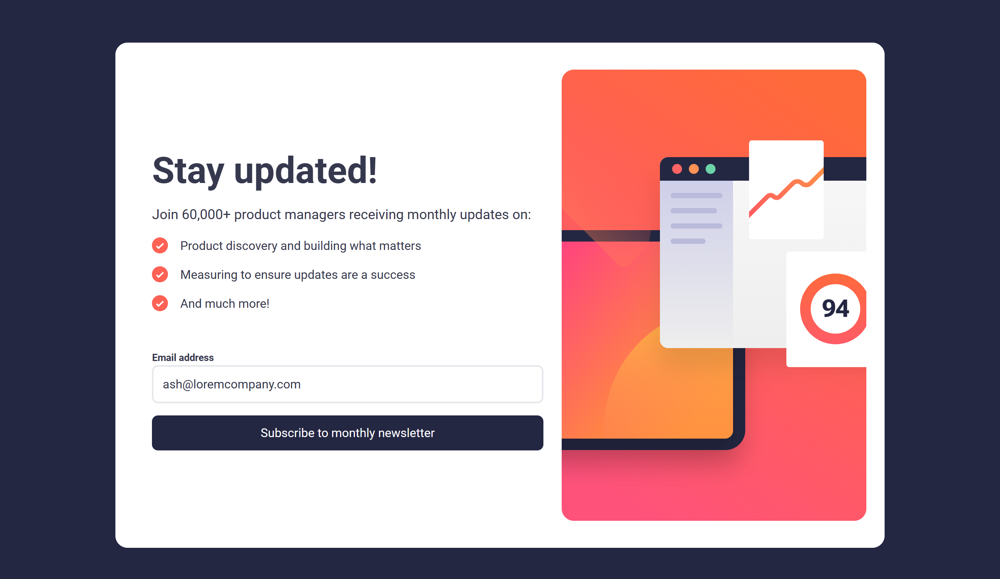
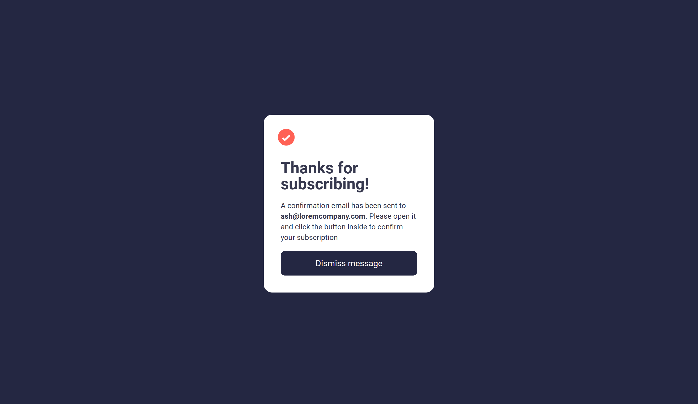

# Frontend Mentor - Newsletter sign-up form with success message solution

This is a solution to the [Newsletter sign-up form with success message challenge on Frontend Mentor](https://www.frontendmentor.io/challenges/newsletter-signup-form-with-success-message-3FC1AZbNrv). Frontend Mentor challenges help you improve your coding skills by building realistic projects.

## Table of contents

* [Overview](#overview)
    * [The challenge](#the-challenge)
    * [Screenshot](#screenshot)
    * [Links](#links)
* [My process](#my-process)
    * [Built with](#built-with)
    * [What I learned](#what-i-learned)
    * [Continued development](#continued-development)
    * [Useful resources](#useful-resources)
* [Author](#author)

## Overview

### The challenge

Users should be able to:

* Add their email and submit the form
* See a success message with their email after successfully submitting the form
* See form validation messages if:
    * The field is left empty
    * The email address is not formatted correctly
* View the optimal layout for the interface depending on their device's screen size
* See hover and focus states for all interactive elements on the page

### Screenshot




### Links

* Solution URL: [Solution](https://github.com/blordeus/newsletter-sign-up-with-success-message-main.git)
* Live Site URL: [Live Site](https://blordeus.github.io/newsletter-sign-up-with-success-message-main/)

## My process

### Built with

* Semantic HTML5 markup
* CSS custom properties
* Flexbox
* CSS Grid
* Mobile-first workflow
* JavaScript
* Tailwind CSS
* DOM Manipulation

### What I learned

I learned how to use JavaScript to toggle the error states of the form and display the success message. This was

``` js
function switchSections(){
  signup.classList.toggle("hide");
  success.classList.toggle("hide");
}
```

### Continued development

During this project, there were times when I got stuck with the JavaScript portion of the project (more specifically, getting the success message to display after form submission and toggling the error message). But after overcoming those issues, I got slightly more comfortable with understanding how to make functions and using id elements to manipulate the DOM.
<br>
## Author


* Frontend Mentor - [@blordeus](https://www.frontendmentor.io/profile/blordeus)
* Twitter - [@blordeus](https://www.twitter.com/blordeus)

